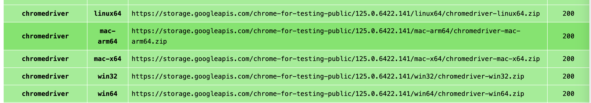
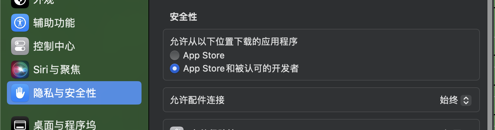

# 爬取抖音个人主页视频下的评论

这里使用的 seleniue库，因为抖音直接访问url的方式爬取数据，需要对请求参数签名，但是我们不知道具体是怎么签名的，如果没有能力逆向出签名的js，那么直接调用接口的方式是行不通的，因为你没有签名值a_bogus，接口直接不返回结果。。所以没办法，直接模拟浏览器的方式，直接访问 用户主页的url。基于渲染好的网页，从网页中获取数据。

seleniue库 本身就是用来做网页自动化测试的库，可以让你通过编写js代码来模拟用户查看网页的点击，下一页等等行为。当然你要对被测试网页的源码有点研究，js也要熟悉。

## 前置环境

- 去该页面 https://googlechromelabs.github.io/chrome-for-testing/ 下载和当前的谷歌浏览器版本一致的 chromedrive

-  解压缩zip
- 文件复制到 /usr/local/bin 目录下（同时修改为可执行 chmod a+x chromedrive）
- 因为我是mac直接运行下，发现是运行不起来的，需要安全性允许下

记得将代码中将`chromeDriverPath`修改为自己的路径
在 cookies.txt文件中配置自己的cookie值

## 使用示例

找一个自己喜欢看的个人主页，复制整个url，例如: https://www.douyin.com/user/MS4wLjABAAAAerv4GJykxEcpsfk69NixWwFr6EfTB6vdqQbQ-LJWolw?vid=7375085981768338715

`MedicalSpider https://www.douyin.com/user/MS4wLjABAAAAerv4GJykxEcpsfk69NixWwFr6EfTB6vdqQbQ-LJWolw?vid=7375085981768338715` 执行命令，抓去的评论就保存到`data`中到csv中。

抖音现在的评论信息可以直接抓去，没有反扒的签名，所以可以直接调用接口。
而用户个人主页，有反扒，使用 a_bogus 签名，找了一些别人逆向好的js，发现都不能用。所以选择直接用(selenium库 + chromedriver)模拟浏览器的方式，直接访问用户主页。整个页面上就有渲染好的`aweme_id`还有视频的url，可以直接爬取评论。

## 存在的问题

打开的用户主页只能看到18条视频，因为需要登录才能看到更多。那就需要用代码的方式来模拟点击操作，执行登录，还有整个页面的自动滚动，这样才能显示更多的视频等等，需要对js比较熟悉，我个人对前端不熟。