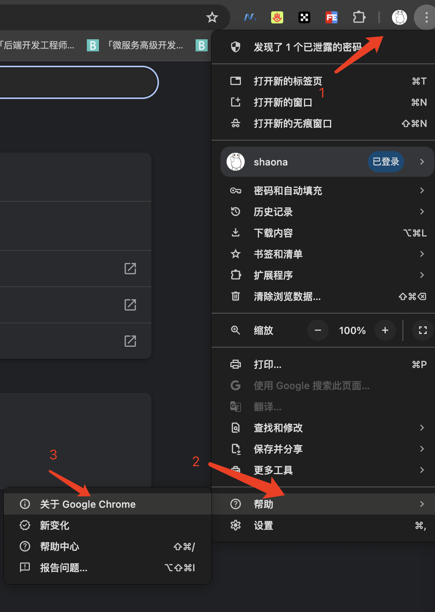

# 爬取抖音个人主页

这里我只需要评论（视频更简单，顺带的事情）

## 注意
这里的代码只是供大家学习，但你用于商业目的及其他恶意用途，请耗子为汁，与作者无关。


## 前置环境


- 去这里查看谷歌浏览器的版本



- 去该页面 https://googlechromelabs.github.io/chrome-for-testing/ 下载和当前的谷歌浏览器版本一致的 chromedrive（截图我的版本，找你自己的版本）


-  解压缩zip
- 文件复制到 `/usr/local/bin` 目录下（同时修改为可执行 `chmod a+x chromedrive`）
- 因为我是mac直接运行下，发现是运行不起来的，需要安全性允许下


- 将`myini.ini`中将`chromedriverpath`修改为自己的路径
- 谷歌浏览器中输入: `chrome://version`命令，将“个人资料路径“这个复制出来，修改 `myini.ini`文件中`userdatadir`的值为你自己的路径；(目的为了复用浏览器的历史数据，这样不用每次都登录。)

## 正文

原本想着，这不是很简单，直接调用视频列表的url不就成了。实际情况是：抖音请求的`url`中有个 `a_bogus`参数，这个参数是对请求参数的签名。但是我们不知道该签名算法。当然有高手可以通过逆向js的方式，获取到这个加密的方式。我去问了，要钱 500块不嫌多，300块不嫌少。算了，贫穷限制了我的消费能力。


后来看到了seleniue库，本质就是使用浏览器（支持Chrome和FireFox）直接访问url，让浏览器帮我们渲染出所有的视频，然后我们把整个网页拿回来，上面不就有了我们想要的数据了嘛。


这里还存在三个问题：
- 启动的浏览器访问用户主页，每次都要求用户扫码登录（不友好）；

这个问题的解决方法只需要在代码中启动浏览器的时候设定`--user-data-dir`,让浏览器使用历史的用户数据，这样cookie信息就可以复用了，不用每次都登录。
```go

func StartChrome() (selenium.WebDriver, error) {
	// 设置Chrome选项

	caps := selenium.Capabilities{
		"browserName": "chrome",
	}

	chromeCaps := chrome.Capabilities{
		Path: "",
		ExcludeSwitches: []string{
			"enable-automation",
		},
		Args: []string{
			//"--headless", // 设置Chrome无头模式，在linux下运行，需要设置这个参数，否则会报错
			"--disable-gpu",
			"--no-sandbox",
			"--user-agent=Mozilla/5.0 (Windows NT 10.0; Win64; x64) AppleWebKit/537.36 (KHTML, like Gecko) Chrome/76.0.3809.132 Safari/537.36", // 模拟user-agent，防反爬
			"--user-data-dir=" + userdatadir, // 这里替换为自己的  在谷歌浏览器中输入 chrome://version
		},
	}
	//以上是设置浏览器参数
	caps.AddChrome(chromeCaps)
	return selenium.NewRemote(caps, "")
}

```

- 因为访问评论信息(这个可以直接调用url访问）的时候我们需要cookie信息，那么就必须等待登录，那么怎么知道用户是否已经登录了？

这个需要大家F12看下网页中的标签，for循环检测特定的标签属性是否存在。
如下：如果没有登录，就会一直存在`semi-button-content`属性，那我们就死循环监视该属性。当登录成功后，即可获取到cookie信息
```go

logger.Info("等待扫码登录...")
	for {
		ele, err := driver.FindElement(selenium.ByClassName, "semi-button-content")
		if err != nil {
			log.Fatal("Error ele:", err)
			return err
		}

		val, _ := ele.Text()
		if !strings.Contains(val, "登录") {
			break

		}
	}

	logger.Info("扫码登录成功")

	// 获取cookies信息
	cookies, err := driver.GetCookies()
	if err != nil {
		log.Fatal("Error cookies:", err)
		return
	}

	cookieStr := []string{}
	for _, cookie := range cookies {

		if cookie.Name != "" {
			cookieStr = append(cookieStr, cookie.Name+"="+cookie.Value)
		} else {
			cookieStr = append(cookieStr, cookie.Value)
		}
	}
	cookieResult := strings.Join(cookieStr, "; ")
	douyin.SetCookie(cookieResult)

```


- 我们知道网页数据的渲染是通过异步的方式，当你下拉到某个位置的时候，才会渲染，抖音视频默认只显示18条视频，那更多的视频怎么办？

那就发命令让浏览器滚动，一直滚动到视频的底部。
这里还有个问题，我们怎么知道到底了？
这就要去看下网页的中的标签值了,网页中有个 `<div class="B_mbw29p">暂时没有更多了</div>`的属性，如果存在并且值为 `暂时没有更多了`，说明已经到底了，否则就一直滚动。

```go
// 模拟自动向下滚动
	for {

		ele, err := driver.FindElement(selenium.ByClassName, "B_mbw29p")
		if err == nil {
			val, _ := ele.Text()
			if strings.Contains(val, "暂时没有更多了") {
				break
			}
		}

		//fmt.Println("执行滚动")
		driver.ExecuteScriptRaw("window.scrollBy(0,1000)", nil)
		time.Sleep(500 * time.Millisecond)
	}

```


所以我个人感觉这个代码的本质其实是在考察前端的知识，怎么通过js的方式来控制浏览器的行为，让其渲染出我们需要的数据。


## 基本逻辑

解决了上面的3个问题以后，代码的基本流程如下：

- 代码会启动一个谷歌浏览器，然后打开用户输入的链接，这个时候，如果抖音没有登录，代码中会死循环等待用户扫码登录自己的抖音账号；
- 然后代码会自动让浏览器向下滚动，一直到达整个视频瀑布流的底部，此时网页上就有了所有的视频；
- 提取网页中的视频的`a`链接，这个时候你可以选择下载视频，也可以获取的视频的id，调用视频的评论列表接口，获取评论信息 


## 使用示例


- 运行程序 `./MedicalSpider`
- 此时会弹出谷歌浏览器出来，不用管；看程序命令行输出，会提示你 【请输入用户主页url:】
- 找一个自己喜欢看的个人主页，复制整个url，例如: https://www.douyin.com/user/MS4wLjABAAAAG0itb5W4abVyFGxSNlGkKvG20un-Ix4R2UfuJUeXHo0?vid=7375750907994197286
- 然后就等待即可（这时看下浏览器，如果需要登录，用app扫码登录，不然程序是不会爬取数据的），最终数据保存到在`data`文件夹下，子文件夹的名字是抖音号
- 爬取完成后，可以继续输入用户主页的url，继续爬取

最终数据如下
